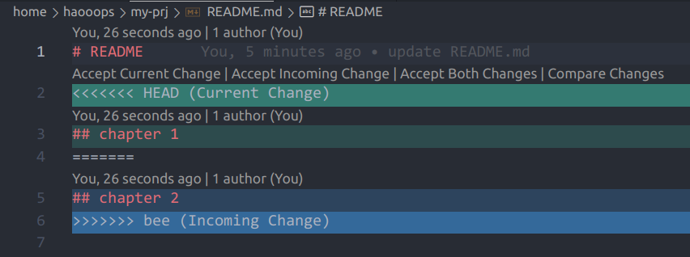
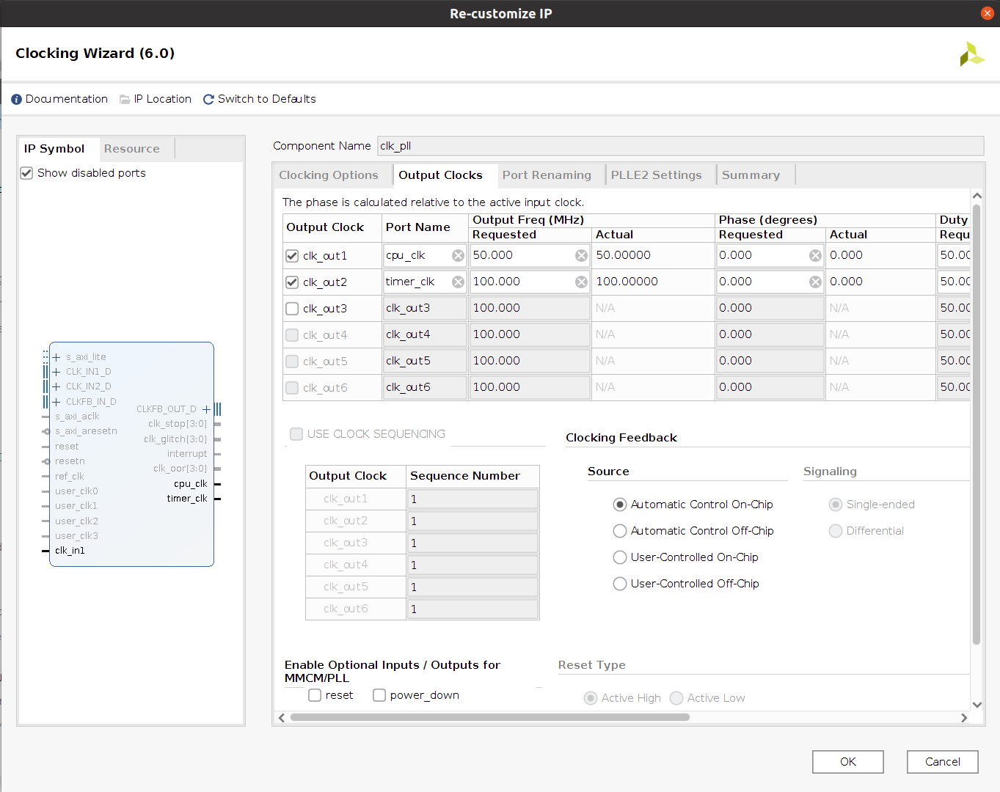

# lec 02 - git 协作与软硬协同

## git 协作

在过去的课程中，大家使用 git 往往是进行个人项目的版本管理，很少涉及多人协作的场景。而对于“龙芯杯”比赛而言，则需要小组内成员合理分工，并使用 git 进行协作开发。使用 git 的诀窍在于脑海里时刻有一张有向图：每一个结点表示一次 commit，每一个边表示两次 commit 之间的变化。

在这张图里，所有结点的公共祖先都是第一次 commit：

```sh
$ mkdir my-prj && cd my-prj
$ touch README.md
$ git init && git add . && git commit -m "init commit"
Initialized empty Git repository in /home/haooops/my-prj/.git/
[master (root-commit) 2d99435] init commit
 1 file changed, 0 insertions(+), 0 deletions(-)
 create mode 100644 README.md

#    HEAD(master)
#      |
#      +
# init commit
#
# 通过 git commit 我们创建了第一个 commit 结点，一个指针
# HEAD 指向我们目前所处的分支 master。
```

对 `README.md` 进行修改：

```sh
$ echo "# README" >> README.md
$ git add . && git commit -m "update README.md"
[master 0493f9d] update README.md
 1 file changed, 1 insertion(+)

#                HEAD(master)
#                  |
#      +----->-----+
#         "update README.md"
#
# 上图中用一条有向边由第一次 commit 指向第二次 commit，
# 表示第二次 commit 是在第一次的基础上变化而来的。
```

创建并切换一个新的分支：

```sh
$ git checkout -b new
Switched to a new branch 'new'

#             master HEAD(new)
#                  |/
#      +----->-----+
#         "update README.md"
#
# 此时创建分支实际上只是创建了一个指针，指向与 master
# 相同的 commit 结点。
```

在新的分支上对 `README.md` 进行修改：

```sh
$ echo "## chapter 1" >> README.md
$ git add . && git commit -m "update README.md"
[new 91a9767] update README.md
 1 file changed, 1 insertion(+)

#                master       HEAD(new)
#                  |           |
#      +----->-----+----->-----+
#                   update README.md
#
# 当我们在 new 上进行修改时，master 指针没有变化。
```

回到 `master` 后创建并切换一个新的分支：

```sh
$ git checkout master && git checkout -b bee
Switched to branch 'master'
Switched to a new branch 'bee'

#             master HEAD(bee)  new
#                  |/           /
#      +----->-----+----->-----+
#                   update README.md
#
# 创建新分支 bee 的效果与之前从 master 上创建 new 相同。
```

在新的分支上对 `README.md` 进行修改：

```sh
$ echo "## chapter 2" >> README.md
$ git add . && git commit -m "update README.md"
[bee b8a67e1] update README.md
 1 file changed, 1 insertion(+)

#               master        new
#                  |           |
#      +----->-----+----->-----+
#                  \----->-----+
#                              |
#                           HEAD(bee)
```

合并 new、bee 两个分支到 new：

```sh
$ git checkout new && git merge bee
Switched to branch 'new'
Auto-merging README.md
CONFLICT (content): Merge conflict in README.md
Automatic merge failed; fix conflicts and then commit the result.
```

此时发生了冲突（conflict），git 提示需要进行手动合并，然后再 commit 一次：
```sh
$ cat README.md
# README
<<<<<<< HEAD
## chapter 1
=======
## chapter 2
>>>>>>> bee

# git 在冲突文件中将产生冲突的部分标记了出来，其中 === 上面的部分表示目前
# 所处分支 new 中的内容，而 === 下面的部分表示待 merge 分支 bee 的内容。
```

我们可以直接对产生冲突的文件进行修改。在 vscode 中，提供了默认的插件，可以方便地进行分支合并：



根据需要点击选项，留下需要的内容，然后再进行一次 commit：

```sh
$ git add README.md && git commit -m "merge new and bee"
[new 0c8d026] merge new and bee

#                master                 HEAD(new)
#                  |                       |
#      +----->-----+----->-----+----->-----+
#                  \----->-----+----->-----/
#                              |
#                             bee
#
# 
# 将 bee 合并到 new 后，创建了一次新的 commit，并将
# HEAD 指针移动到该 commit。
```

合并 new 分支到 master：

```sh
$ git checkout master && git merge new
Updating 0493f9d..0c8d026
Fast-forward
 README.md | 2 ++
 1 file changed, 2 insertions(+)

#                             HEAD(master) new
#                                         \|
#      +----->-----+----->-----+----->-----+
#                  \----->-----+----->-----/
#                              |
#                             bee
#
# 由于 new 是从 master 上发展过来的，因此 merge
# 操作仅仅是将 master 指针移动到了 new。
```

合并的规律：
+ 如果两次 commit 代表的结点有连通的路径，则合并时仅改变指针
+ 如果没有，则会创建一个新的结点，并可能产生冲突

## 总线接口

> “在大多数真实的计算机系统中，CPU 通过总线与系统中的内存、外设进行交互。没有总线，CPU 就是个‘光杆司令’，什么工作也做不了。总线接口可以自行定义，也可以遵照工业的标准。显然，遵照工业界的标准有助于与大量第三方的 IP 进行集成。” — _《CPU 设计实战》_

在大家之前的实验中，我们使用的是同步 RAM 接口，它具有一个很简单的时序：当拍发送地址，下一拍就能返回数据。然而，并不是所有设备都能保证同步 RAM 接口的时序要求：也许从发起请求到收到数据之间会间隔许多时钟周期，这样，数据的请求方就不能默认请求发出的下一拍时，返回的数据是有效的。另一方面，CPU 和其他设备很可能工作在不同的时钟频率下，因此它们的信号是异步的，需要使用接口进行同步。

因此，必须引入**握手**（handshaking）机制，使得数据的**主方**（请求方，master）和数据的**从方**（接收方，slave）能够按照正确的时序协作。同时，接口有利于工业界制定统一的标准，使得设备的扩展变得容易。

在实验中，我们所使用的类 SRAM 接口是自定义接口，之后的 AXI 接口则是工业标准。

## SOC 结构

SOC 描述了**主从设备**、**转换桥**及其**互联关系**，我们可以在 `mycpu_env/soc_verify/soc_hs_bram/soc_lite_top.v` 中找到它的原理图：

```
     -------------------------
     |           cpu         |
     -------------------------
   inst|                  | data
       |                  | 
       |        ---------------------
       |        |    1 x 2 bridge   |
       |        ---------------------
       |             |            |           
       |             |            |           
-------------   -----------   -----------
| inst ram  |   | data ram|   | confreg |
-------------   -----------   -----------
```

在实验用的 SOC 中，CPU 是主设备，inst ram、data ram 和 confreg 是从设备，1 x 2 bridge 是转换桥。

CPU 对外暴露两个类 SRAM 接口，其中一个直接连接到同样具有类 SRAM 接口的 inst ram 上；另一个连接到一个 1 x 2 bridge 上，它的作用是将一个接口变成两个，从而可以连接两个设备：data ram 和 confreg。

## 控制外设

先来看硬件部分。LoongArch 访问外设的方法是 **MMIO**，也就是将外设寄存器直接映射到地址空间上，CPU 通过 `ld/st` 指令进行操作。CPU 访问外设的数据通路是：

- 流水线向数据类 SRAM 总线发起访存请求（CPU 内部逻辑）
- 访存请求到达 1 x 2 bridge 上，转换桥进行仲裁，将请求送到与 confreg 相连的总线上（`bridge_1x2.v`）
- confreg 请求，内部进行处理，改变输出端口的电平（`confreg.v`）
- 通过约束文件将输出端口绑定到芯片引脚上，从而控制具体的外设（`soc_lite_top.xdc`）

再来看软件部分。我们需要使用 `ld/st` 指令来操作外设，因此，需要知道**访问的地址**以及**读写数据的含义**。在运行的功能测试程序中，我们已经使用了 LED、数码管以及拨码开关这 3 种外设。通过阅读功能测试的代码，可以了解控制它们的方式，而这些控制程序就是它们的**驱动程序**。

!!! warning "注意"

    外设分为**可探测**和**不可探测**两种，我们所使用的外设**全部为不可探测**外设。因此，需要进行*软硬件协同*，驱动程序开发者需要知道 SOC 设计时为外设分配的地址空间。

### 直接读写外设

以下外设直接通过读写对应的地址映射的寄存器来控制：

|外设名称|地址|宽度|读写属性|读值|写值|
|:---:|:---:|:---:|:---:|:---:|:---:|
|双色 LED|`0xbfaf_f030`<br>`0xbfaf_f040`|32 bit|W|-|`0x0` 熄灭<br>`0x1` 绿色<br>`0x2` 红色<br>`0x3` 红绿色（更偏红）|
|单色 LED|`0xbfaf_f020`|32 bit|W|-|末 16 位每比特对应一个 LED，`0x1` 为灭，`0x0` 为亮|
|数码管|`0xbfaf_f050`|32 bit|W|-|32 位每 4 位对应 1 个数码管显示的值|
|拨码开关|`0xbfaf_f060`|32 bit|R|末 8 位每比特对应一个开关，拨上为 `0x0`，拨下为 `0x1`|-|
|矩阵键盘|`0xbfaf_f070`|32 bit|R|末 16 位每比特对应一个按键，松开为 `0x0`，按下为 `0x1`|-|

说明：

- 双色 LED 有两个地址，低地址对应 FPGA 板上右侧的 LED ，高地址对应左侧 LED 。
- 矩阵键盘末 16 位与键盘位置对应关系为：

	```
	+----+----+----+----+
	|  0 |  1 |  2 |  3 |
	+----+----+----+----+
	|  4 |  5 |  6 |  7 |
	+----+----+----+----+
	|  8 |  9 | 10 | 11 |
	+----+----+----+----+
	| 12 | 13 | 14 | 15 |
	+----+----+----+----+
	```

!!! info "信息"

    在 confreg 的实现中，拨码开关的复位值被显示到单色 LED 上，有兴趣的同学可以参看 `confreg.v` 了解它是怎么实现的。

### 外部计数器

confreg 中实现了一个**恒定频率计数器**为整个 SOC 提供计时功能。具体而言，confreg 模块具有两个时钟输入 clk 和 timer_clk，其中 clk 用于 confreg 中寄存器的驱动，timer_clk 则用于计数器的驱动，使其每个周期自动加一。在我们使用的 SOC 中，timer_clk 的频率是 100MHz，通过查看时钟 IP 核 clk_pll 的配置可以明确这一点：



在 confreg 中，计数器是一个 RW 类型的寄存器，我们可以写入一个值对它进行设置，也可以读出当前的值，它的地址为 `0xbfaf_e000`。

通过这个计数器，软件可以实现 `delay()` 和 `sleep()` 等带有定时功能的函数。

### 扩展其他外设

在目前的 SOC 中，使用的是类 SRAM 总线接口。前面提到，它是一种自定义接口，因此扩展起来有一些麻烦：我们需要自己编写满足类 SRAM 接口的外设控制器以及转换桥。而后续使用的 AXI 接口则是一种工业接口，在 Vivado 中可以很方便地调用许多具有 AXI 接口的外设控制器以及转换桥（一般采用交叉总线 cross bar 的形式，简称 xbar），并且 Vivado 提供了 Block Design 功能方便我们进行 SOC 设计。

简单来说，添加不可探测的外设需要以下几个步骤：

1. 编写 RTL 或调用 IP 核得到外设控制器
2. 手动为外设控制器分配地址空间，将其通过转换桥接入 SOC
3. 根据分配的地址，编写对应的驱动程序，实现自定义功能

## 裸机程序

裸机程序运行时没有操作系统，更得不到库函数的支持。编写裸机程序是为了更好地理解软硬件是如何协同工作的。

### 第一入口：汇编语言

LoongArch32r 架构的复位 PC 为 `0x1c00_0000`，计算机复位后立即从该地址取指令，因此我们编写的裸机程序入口也在这里。之所以要使用汇编语言，是因为计算机复位时只有有限的资源状态是确定的，不足以运行 C 语言程序，我们需要使用汇编指令为运行 C 语言程序做好充足的准备。

首先我们需要明确在计算机复位后有哪些资源状态是确定的，以及运行 C 语言程序需要哪些资源。

+ 复位后确定状态的资源：	
	+ 通用寄存器：`$r0 = 0x0`，`$pc = 0x1c00_0000`
	+ 特权寄存器：
		+ `CRMD`：`PLV = 0x0`，`IE = 0x0`，`DA = 0x1`，`PG = 0x0`，`DATF = 0x0`，`DATM = 0x0`
		+ `ECFG`：`LIE = 0x0`
		+ `ESTAT`：`IS[1:0] = 0x0`

+ 运行 C 语言需要的资源：
	+ 通用寄存器：`$sp` 需要指向一段可用的内存作为栈
	+ 内存：将 bss 段初始化为 `0x0`

!!! warning "注意"

    由于目前 CPU 还不支持虚拟内存管理，其他内容无需由我们设置。CPU 复位后默认处于“直接地址翻译模式”，我们仅保持在该模式下即可驱动外设，并运行一些程序。

    SOC 中的指令、数据 RAM 大小均为 1MB，都映射到地址段 `0x1c00_0000 ~ 0x1c0f_ffff`。我们在逻辑上将它们视为一个，装载相同的二进制文件，只要没有自修改代码，程序便能正常运行。

### 第二入口：C 语言

准备好 C 语言环境后，就可以从汇编语言跳转到 C 语言执行了：

```S title="start.S"
...
bl main
```
```c title="main.c"
int main()
{
    ...
}
```

之后我们便可以使用 C 语言操作这些外设了，如果你还不清楚什么 C 语言如何对应到 `ld/st` 指令，请复习《计算机体系结构基础》。

### 链接脚本

为了能够自定义程序的布局，我们需要编写一个链接脚本：

```ld title="bare-metal.ld"
SECTIONS
{
    . = 0x1c000000;             /* 指定起始地址 */
    .text : {                   /* 所有 text 段紧跟其后 */
        *(.text)
    }
    .rodata : {                 /* 所有 rodata 段在 text 段后面 */
        *(.rodata)
    }
    .data : {                   /* 所有 data 段在 rodata 段后面 */
        *(.data)
    }

    .bss : {                    /* 所有 bss 段在 rodata 段后面 */
        __bss_start = .;        /* 定义一个标号指向 bss 的开始位置 */
        *(.bss)
        __bss_end = .;          /* 定义一个标号指向 bss 的结束位置 */
    }

    . = ALIGN(0x1000);          /* 要求下一个标号开始的位置对齐到 0x1000 (4KB) */
    bootstack = .;              /* 定义一个标号指向栈底 */
    bootstacktop = . + 0x1000;  /* 定义一个标号指向栈顶 */
}
```

有了链接脚本，我们可以直接在汇编或 C 语言中使用定义的标号，比如将栈顶存储到寄存器 `$sp`：

```S title="start.S"
...
la $sp, bootstacktop
```

### 二进制文件与 COE 文件

为了将程序直接加载到 FPGA 上的 RAM 中，我们需要将程序转化为 Vivado 能识别的 `.coe` 文件，其中包含了一些描述头和载入 RAM 的二进制内容，我们可以使用课程环境下的 `convert` 工具将二进制文件转化为 COE 文件。

整体的转换流程如下：

```
  start.S   gcc              objcopy           convert
  main.c   ----->  main.elf  ----->  main.bin  ----->  inst_ram.coe
(source code)     (elf file)       (binary file)        (coe file)
```

我们可以编写一个 Makefile 将整个流程连接起来：

```Makefile title="Makefile"
CROSSTOOL:=loongarch32r-linux-gnusf-
CC       :=$(CROSSTOOL)gcc
OBJCOPY  :=$(CROSSTOOL)objcopy
OBJDUMP  :=$(CROSSTOOL)objdump

.PHONY: clean

all: inst_ram.coe inst_ram.mif

main.elf: start.S main.c bare-metal.ld
	$(CC) -nostdlib -T bare-metal.ld start.S main.c -O0 -o $@

main.bin: main.elf
	$(OBJCOPY) -O binary main.elf main.bin

inst_ram.coe inst_ram.mif: main.bin convert
	./convert

convert: convert.c
	gcc ./convert.c -o convert

test.S: main.elf
	$(OBJDUMP) -d main.elf > $@

clean:
	rm -rf main.elf main.bin test.S inst_ram.coe inst_ram.mif rom.vlog convert
```

在使用 gcc 编译程序时，使用了一个特殊的选项 `-nostdlib`，顾名思义，该选项的含义是不使用标准库。这是因为对于裸机程序而言，没有操作系统的支持，我们是无法使用标准库的。

### 上板测试

1. 打开工程，使用上面产生的 `inst_ram.coe` 来 recustomize inst_ram。
2. 使用上面产生的 `inst_ram.coe` 来 recustomize data_ram。
3. 生成比特流，烧入到实验箱中，观察结果。

!!! info "信息"

    由于目前我们使用的是类 SRAM 总线，SOC 为“[哈佛结构](https://en.wikipedia.org/wiki/Harvard_architecture)”，`inst_ram` 和 `data_ram` 分开，因此需要将 ELF 文件中的代码段加载到 `inst_ram` 中，将数据段加载到 `data_ram` 中。因为目前的 COE 文件同时提取了 ELF 文件的代码段和数据段，所以我们只需要将 COE 文件同时加载到两个 RAM 中即可。

    切换到 AXI 总线后，SOC 就变成了“[冯·诺依曼结构](https://en.wikipedia.org/wiki/Von_Neumann_architecture)”，`inst_ram` 和 `data_ram` 合为了一个 `axi_ram`，因此只需要将 COE 文件加载到这个 RAM 中即可。


!!! question "练习"

    1. 编写一个裸机程序，实现 16 个单色 LED 的跑马灯功能。要求：16个单色 LED 从右到左依次点亮，每个灯点亮 1s 后立刻切换到下一个灯。
    2. 编写一个裸机程序，实现斐波那契数列的求和功能。要求：
        
        1. 用拨码开关的复位值控制求和的项数，拨上为 1，拨下为 0，记拨码开关的值为 `n`。求第 0 项到第 `n` 项的和。
        2. 将求和结果以 16 进制的形式输出到数码管上。
        3. （选做）利用拨码开关和矩阵键盘实现多次不同输入的求和计算。调整拨码开关的值，程序等待按下某个自定义的矩阵键盘按键（类比输入“回车”），得到输入，计算结果。

## 参考资料

- [重庆大学操作系统实验文档](https://osdocs.cqu.ai/)
