# Lec 03 - SOC 搭建

本次培训将指导大家使用 Vivado 的 Block Design 功能搭建自己的 SOC，并在此基础上添加串口控制器，与其他计算机进行串口通信。

## 将 RTL 代码封装为 IP 核

经过本周的实验，大家的 CPU 核已经改为向外暴露一个 AXI 接口，从而使得*片上互联*与*外设扩展*变得简单。我们使用 Vivado 提供的 Block Design（简称为 BD）功能便能搭建出一个基于 AXI 总线的 SOC，并能方便地进行外设扩展。而在 BD 中，搭建的单位由 Verilog 源码变为了 IP 核，因此需要将 SOC 中的主从设备先封装为 IP 核。

以封装 mycpu 为 IP 核为例，从 RTL 代码到 IP 核的过程为：

- 新建 Vivado 工程，其中仅包含 mycpu 的 RTL 源码，即顶层模块为 `mycpu_top`

!!! warning "注意"

    如果你的 CPU 核中调用了 Xilinx IP 核，那么需要将 IP 核一同加入到工程中。如果想要在新项目中加入一个已经在其他项目中定制的 IP 核，那么**无需重新定制**，只需要将描述 IP 核的 `.xci` 文件添加到项目中即可，添加方式与添加 RTL 源码相同。`.xci` 文件具体的位置为 `<Project Home>/*.srcs/sources_1/ip/<IP Name>/*.xci`。

- 将 `mycpu_top.v` 中的 `debug_wb_*` 接口注释掉，这是为了后续定义 IP 接口时不产生混淆

### 封装前的配置

- 点击 Tools :material-arrow-right: Create and Package New IP... 选项，开始封装一个 IP 核：

    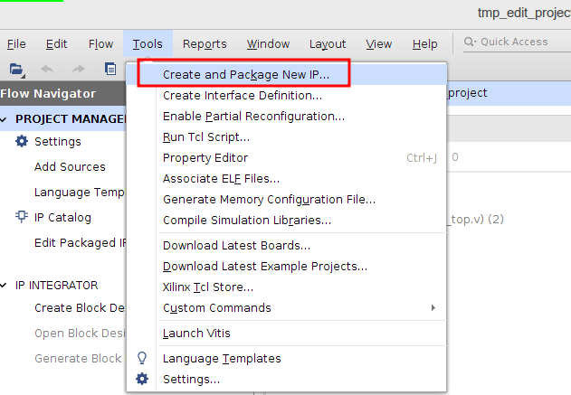

- 而后，将弹出一个设置界面，点击 Next：

    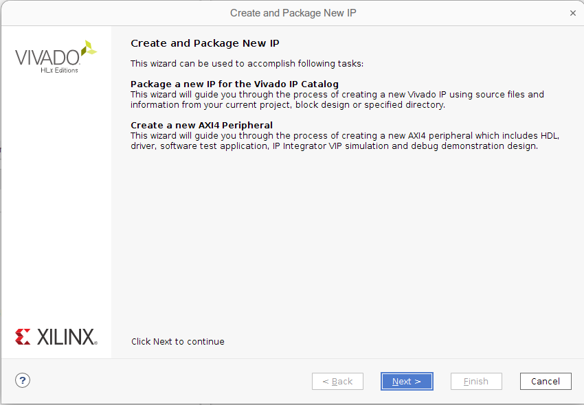

- 选择 Package your current project，设置封装目标为当前项目，然后点击 Next：

    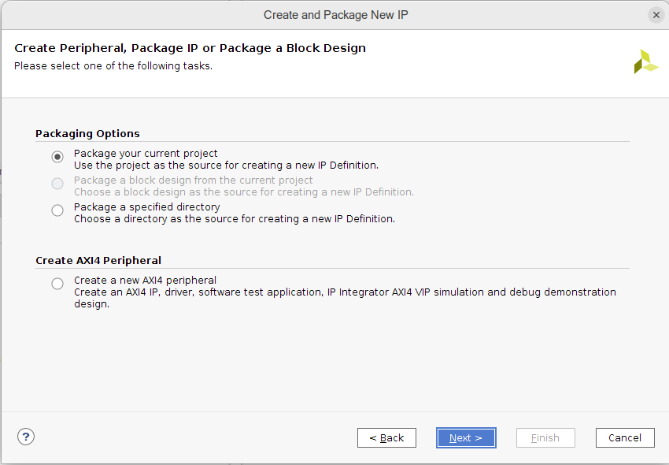

- 接下来在 IP location 输入框中输入自定义路径，该路径为 IP 文件的输出路径，然后点击 Next：

    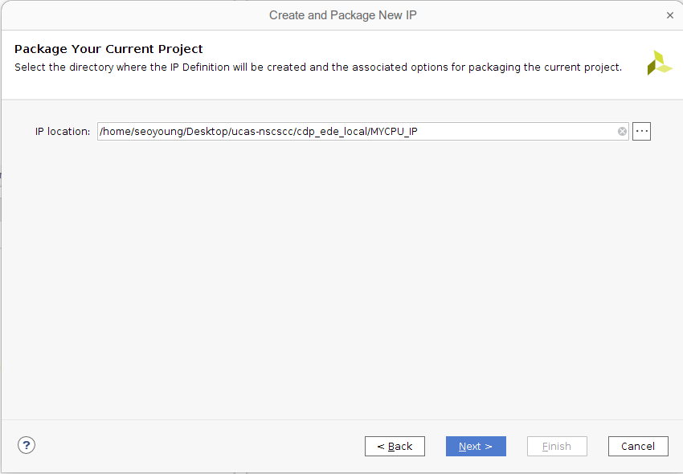

- 之后将弹出一个窗口询问是否拷贝源码，点击 OK：

    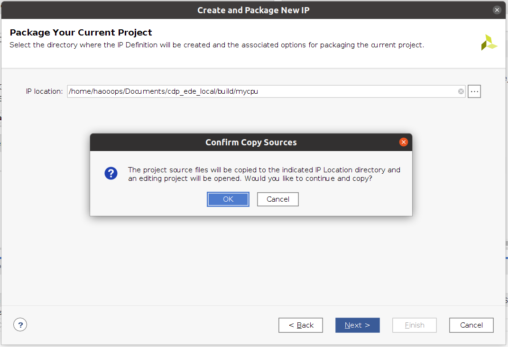

!!! warning "注意"

    如果 IP location 填写的路径下已经存在了之前封装过的 IP，则会弹出一个窗口询问是否覆盖，为了创建最新版本的 IP，点击 Overwrite：
    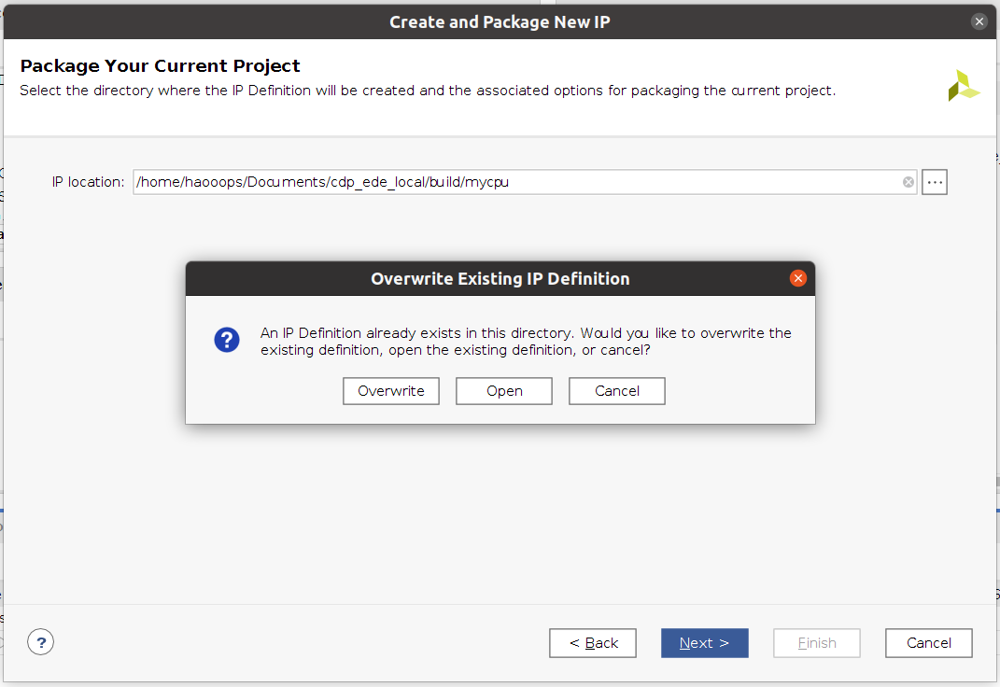

- 最后，点击 Finish，将会弹出一个新的临时工程用于配置 IP：

    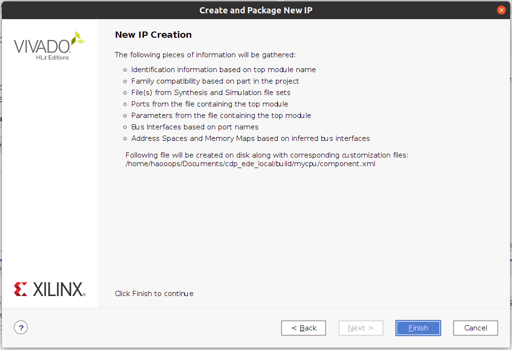

### 在临时工程中配置 IP

弹出的临时工程将自动打开 Package IP 的配置界面，按照下面的步骤对 mycpu IP 进行配置。

- 点击 Ports and Interfaces :material-arrow-right: 右键 interface_aximm[^1] :material-arrow-right: Edit Interface配置 mycpu 对外暴露的 AXI 接口：

    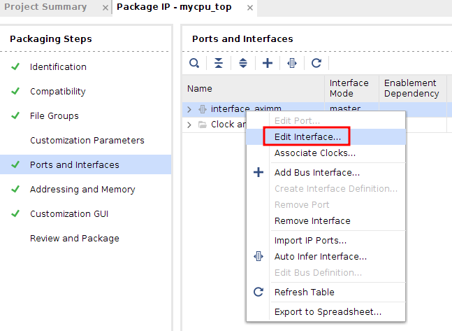

- 在弹出的窗口中，可以看到对该接口的配置信息，切换到 Port Mapping 选项卡，在**最下面**的窗口中检查 AXI 接口信号（左侧大写）与 `mycpu_top` 中的信号（右侧小写）是否匹配[^2]：

    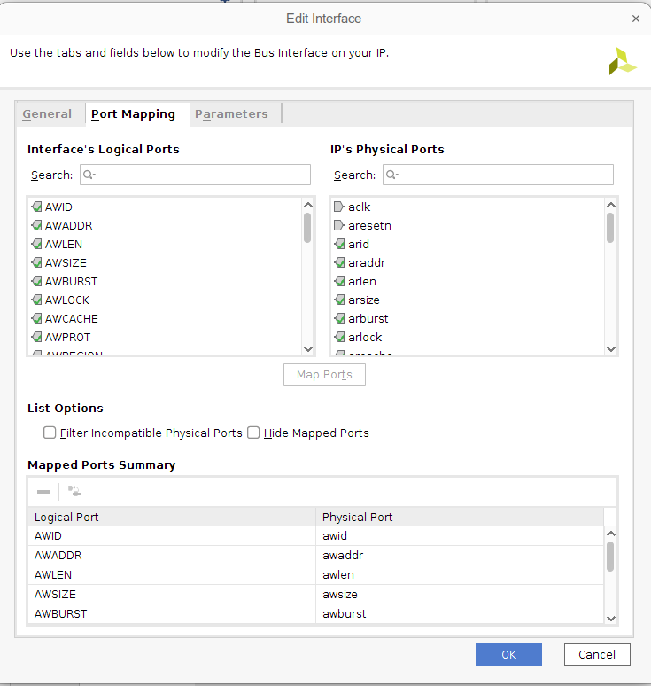

- 切换到 Parameters 选项卡，配置接口的参数。点击右侧的 :octicons-diff-added-16: 按钮创建参数，在弹出的窗口中输入参数名为 `FREQ_HZ`，创建完成后，该参数位于 Optional 中，修改 value 一列对应的值为 mycpu 的**实际运行频率**，建议为 50MHz：

    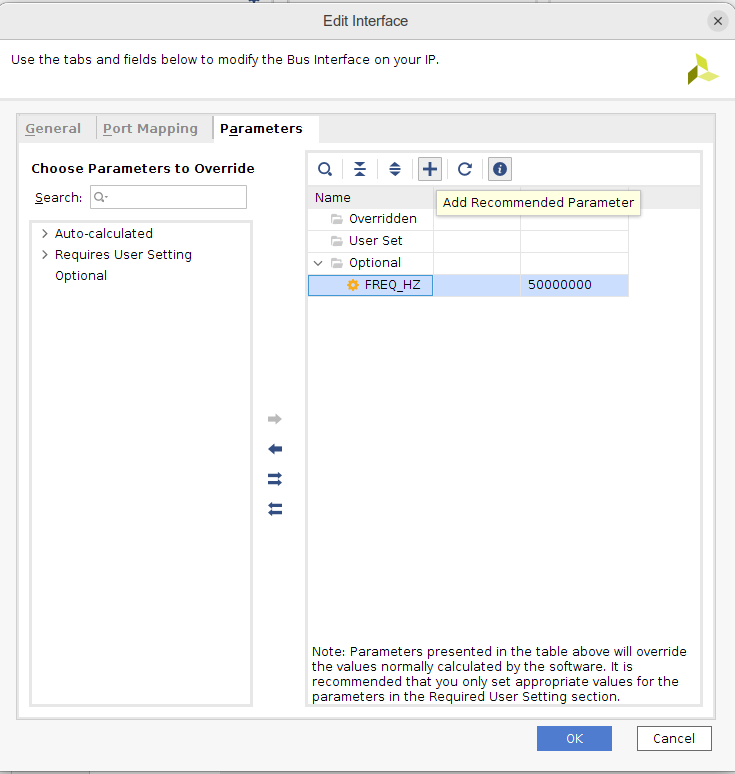

- 点击 OK 关闭 Edit Interface 窗口后，点击 Review and Package :material-arrow-right: Package IP 按钮封装 IP：

    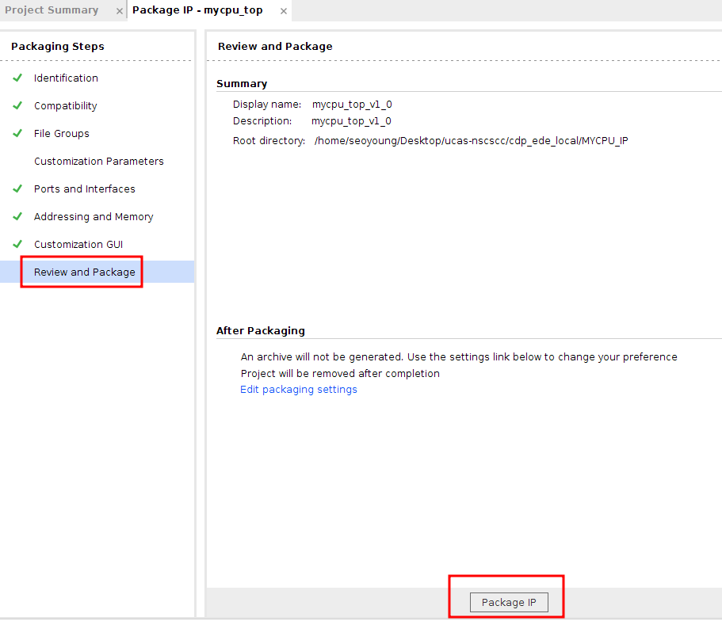

- 由于上一小节在 IP location 中填写的是该项目的位置，因此 IP 的 `.xml` 描述文件位于该项目的根目录下：

    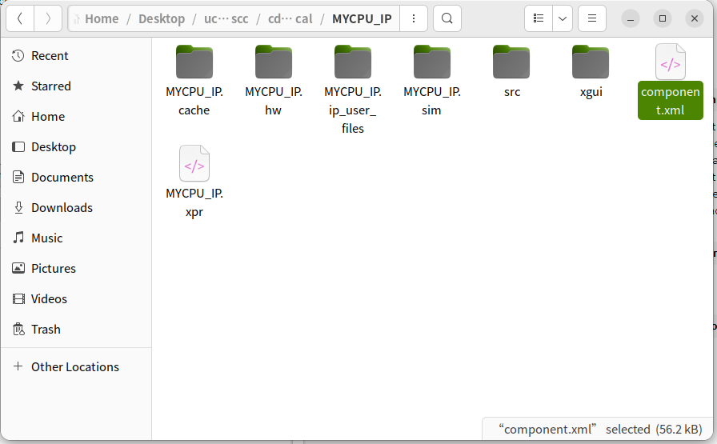

!!! question "练习"

    为了在搭建好的 SOC 上使用 GPIO 功能，我们需要将 AXI 接口的 confreg 也封装为 IP。仿照封装 mycpu 的方法，新建一个工程，将 confreg 也封装为 IP 核。

## 使用 BD 功能搭建 SOC

我们可以直接使用创建 IP 核的项目搭建 SOC，也可以新创建一个项目。这里选择新建一个名为 mysoc 的项目。首先，以 tcl 终端模式启动 Vivado：

```sh
$ vivado -mode tcl

****** Vivado v2019.2 (64-bit)
  **** SW Build 2708876 on Wed Nov  6 21:39:14 MST 2019
  **** IP Build 2700528 on Thu Nov  7 00:09:20 MST 2019
    ** Copyright 1986-2019 Xilinx, Inc. All Rights Reserved.

Vivado% 
```

### 导入 IP 仓库

启动完毕后，最底行显示的 `Vivado%` 相当于 shell 中的命令提示符，我们可以向终端输入命令来控制 Vivado 的行为。我们首先需要将创建的 IP 核导入新建的 Vivado 工程，使得在其中可以进行调用。

- 创建 Vivado 工程 mysoc，并使用 tree 工具查看生成的工程：

    === "tcl console"

        ```sh
        Vivado% create_project -force ./mysoc ./mysoc -part xc7a200tfbg676-1
        ```

    === "shell"

        ```sh
        $ tree ./mysoc
        ./mysoc/
        ├── mysoc.cache
        │   └── wt
        │       └── project.wpc
        ├── mysoc.hw
        │   └── mysoc.lpr
        ├── mysoc.ip_user_files
        └── mysoc.xpr

        4 directories, 3 files
        ```

- 创建完成后，Vivado 已经默认在当前 tcl 终端中打开了 mysoc 工程，将刚才创建的 IP 核导入当前工程[^3]：

    ```sh
    Vivado% set_property  ip_repo_paths  {<Mycpu Home> <Confreg Home>} [current_project]
    ```

### 启动图形界面搭建 SOC

- 通过命令 `start_gui` 启动图形界面：

    ```sh
    Vivado% start_gui
    ```

- 启动图形界面后，点击 Flow Navigator :material-arrow-right: IP INTEGRATOR :material-arrow-right: Create Block Design 创建一个 Block Design：

    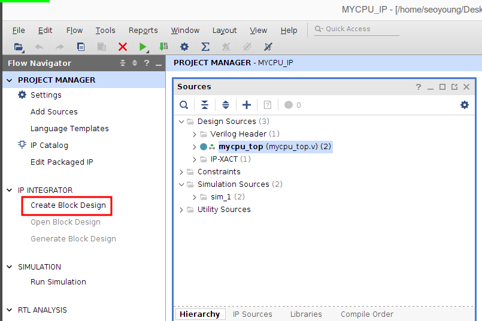

- 而后在打开的 Diagram 选项卡中点击 :octicons-diff-added-16: 添加 IP 核，由于已经添加了 IP 仓库，因此可以看到自定义的 mycpu_top_v1_0 IP 核：

    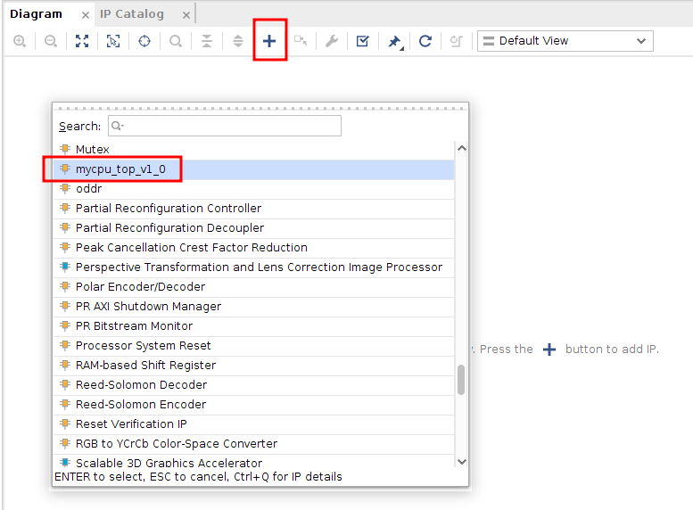

#### 添加 mycpu

- 双击 mycpu_top_v1_0，相应的原理图将出现在 Diagram 中：

    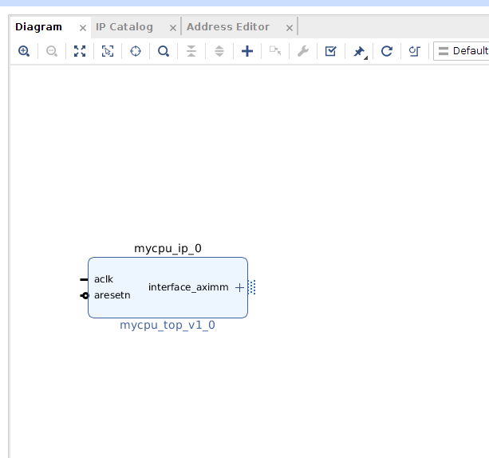

    该原理图显示了 IP 核 mycpu_top_v1_0 中的所有接口，方框左侧为输入（从方）接口，右侧为输出（主方）接口。由于右侧为标准的主方 AXI 接口，因此所有的信号都包含在 interface_aximm 中，点击 :octicons-diff-added-16: 可以查看其中包含的信号。

#### 添加 AXI Crosscar

- 下一步，需要创建基于 AXI 总线的片上互联结构，添加一个 AXI Crossbar：

    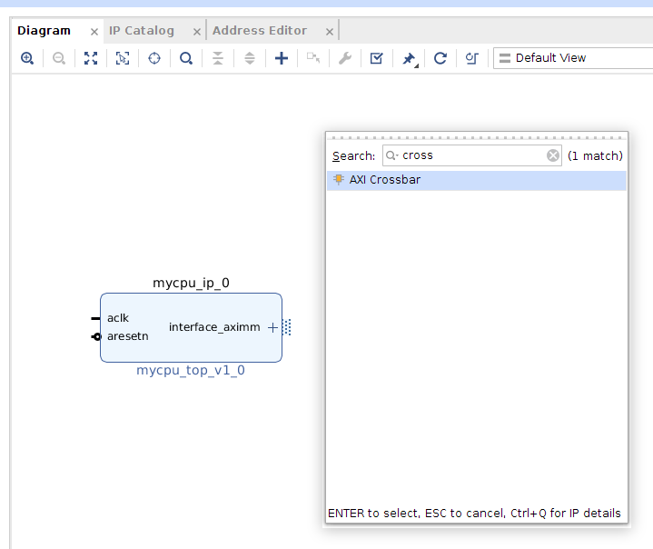

#### 添加时钟与复位系统

- 添加 AXI Crossbar 后，可以使用鼠标连接 mycpu 的主方 AXI 接口与 Crossbar 上的从方 AXI 接口。同时，在上方将弹出一个绿色的提示框，提示可以自动连接线路，点击 Run Connection Automation：

    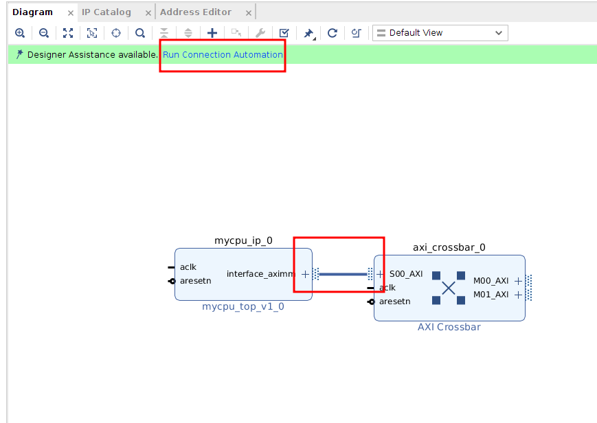

- 自动连线后，Vivado 将自动引入时钟 IP Clocking Wizard 与复位 IP Processor System Reset 并完成部分线路的连接：

    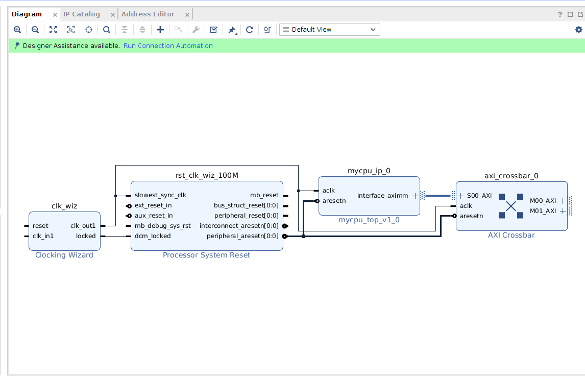

- 我们需要重新定制 IP clk_wiz，双击该模块，在弹出的配置窗口中切换到 Output Clocks，配置 cpu_clk 为 50MHz，timer_clk 为 100MHz：

    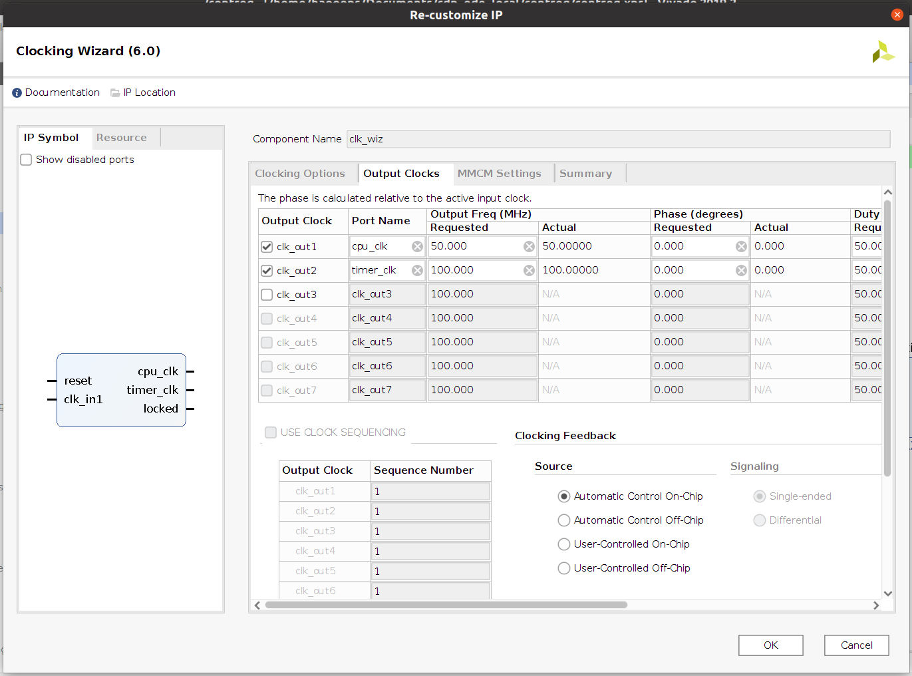

- 将该选项卡拖动到最底下，将 Reset Type 设置为 Active Low：

    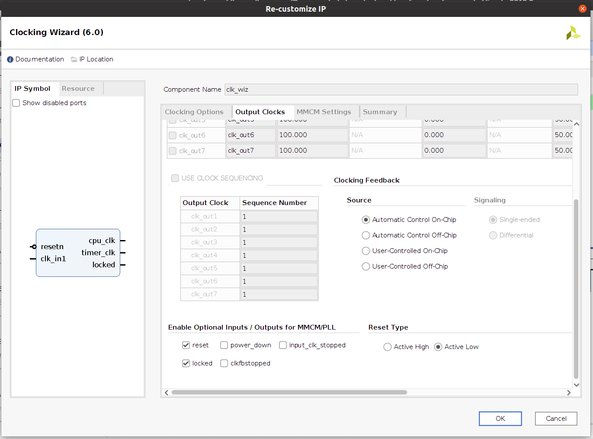

- 在点击 OK 保存设置后，Diagram 中连接 clk_wiz 的线路将自动断开，需要手动将 cpu_clk 接口连接到与 mycpu 中 aclk 接口相同的线路上：

    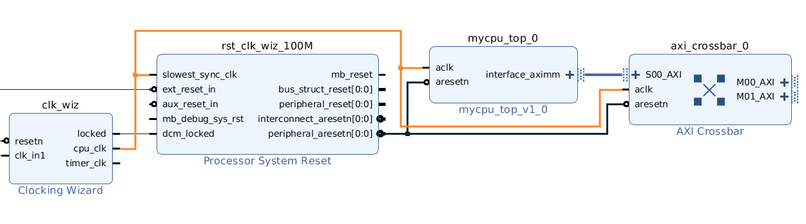

- 需要将 clk_wiz 上的 resetn 与 clk_in1 接口引出，最终约束到开发板的引脚上。将鼠标置于 clk_wiz 的 clk_in1 接口上，右键点击，在弹出的选项框中点击 Make External：

    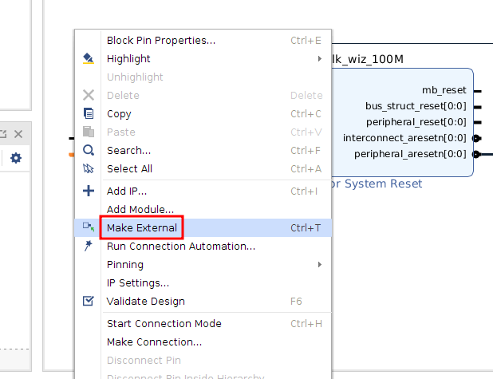

- 使用同样的方法将 resetn 设置为外部接口，然后将 rst_clk_wiz_100M 的 ext_reset_in 信号连接到与 resetn 相同的线路上：

    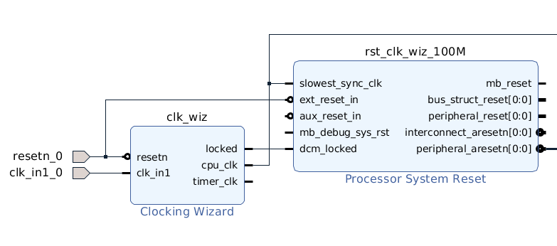

至此，一个基本的 SOC 框架就搭建完成了，我们可以根据需要在 SOC 中添加各种 AXI 设备。

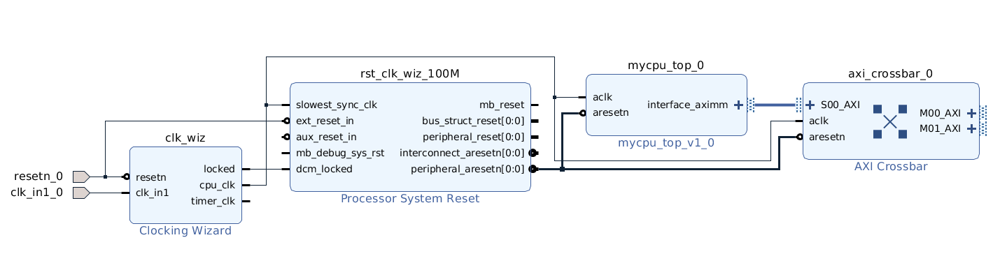

[^1]: 实际接口名称可能不是 interface_aximm
[^2]: 之前注释 `debug_wb_*` 信号就是为了这一部几乎无需修改映射信息
[^3]: 需要将 `<Mycpu Home>` 和 `<Confreg Home>` 分别替换为封装 mycpu 和 confreg 的工程根目录
