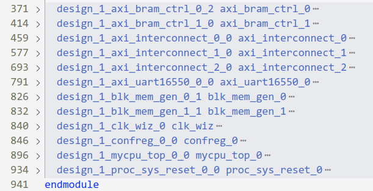
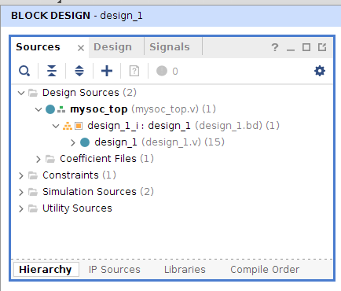
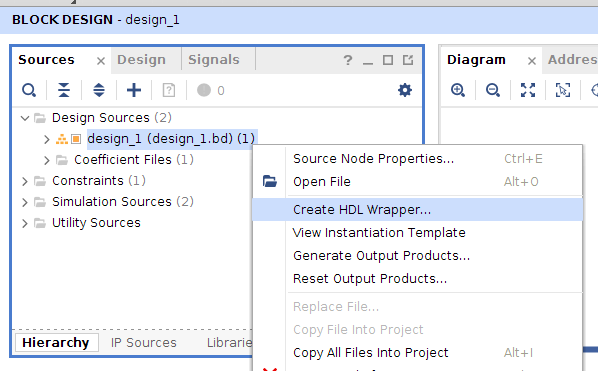

# Lec 04 - SOC 上板与系统启动
## 上板测试 SOC

经过上一讲的学习，我们已经搭建好 SOC 的结构，想要让我们的 SOC 能够综合、实现并最终生成比特流文件，我们还缺少两个文件：项目 wrapper 文件和约束文件。下面分别进行介绍。

### 创建 wrapper

在 `mysoc/mysoc.srcs/sources_1/bd/design_1/synth` 这个目录下，我们能找到名为 `design_1.v` 的文件，可以看到其中的 `design_1` 模块实例化了所有放到 BD 中的 IP ：



然而在现在这个状态下，整个模块是无法综合的。我们需要写一个 wrapper 作为顶层文件。wrapper 需要包含以下几点要素：

- 设计顶层 wrapper 模块的 input、output 信号，使它们在信号名和位宽上和约束文件中的内容匹配；
    ``` Verilog title="mysoc_top.v"
    module mysoc_top(
        input clk,
        ...
        // 使用我们习惯的方式命名
        // 而不是 design_1 中生成的 led_0、uart_rtl_xxxx
        // 方便与约束文件的信号名匹配
        output [15:0] led,
        ...
    );
    ...
    endmodule
    ```
- 实例化 `design_1`，并对 `design_1` 的输入输出信号做必要处理。
    ``` Verilog title="mysoc_top.v"
    module mysoc_top(
        ...
    );
        design_1 design_1_u(
            .clk_in1_0   (clk),
            ...
            .led_0       (led),
            ...
        );
    endmodule
    ```

!!! warning "注意"

    由于当前 mysoc 结构较为简单，没有复杂的外设，因此在 `mysoc_top` 中我们只进行简单的连线即可。但随着 mysoc 中外设复杂度的提升，可能有一些外设接口类型为 `inout`。这时，由于在 Block Design 中使用 Make External 引出的信号只能是单向的，从而无法满足实际要求。对于这种情况，wrapper 中还需手动处理相应信号。

通过在 Vivado 中 Add Sources，我们将这个文件添加到工程中来。它将被自动识别为顶层文件。



#### vivado生成 wrapper

当然，也可以由 Vivado 先替我们生成一个 wrapper 文件，实例化好 `design_1` 模块，我们再在其中做修改。因为是 Vivado 生成的，所以不可避免还会出现信号名复杂、信号待处理的情况，还需要我们手动修改，只不过它帮助我们例化好模块了，在其基础上修改可以提高一定的代码准确度。

按照下图进行操作：



### 约束文件

对于一个完整的 FPGA 设计，还需要有时序约束和管脚约束。这些约束都体现在以 `.xdc` 为后缀的约束文件当中。这里以体系结构实验环境提供的约束文件（`mycpu_env/soc_axi/run_vivado/constraints/soc_lite_top.xdc`）为例来简单讲解。

- **时序约束**，比如设置 SOC 时钟频率，上升沿、下降沿位置等。下面这行约束说明我们的时钟周期是 10ns，上升沿在 0ns 处，下降沿在 5ns 处，这条属性绑定在 clk 信号上。
    ``` xdc title="soc_lite_top.xdc"
    create_clock -period 10.000 -name clk -waveform {0.000 5.000} [get_ports clk]
    ```

- **管脚约束**，把信号和 FPGA 上的引脚绑定起来，规定管脚的电平标准。

    下面约束表示把 `led[0]` 信号绑定到 `K23` 引脚上。

    ``` xdc title="soc_lite_top.xdc"
    set_property PACKAGE_PIN K23 [get_ports {led[0]}]
    set_property PACKAGE_PIN J21 [get_ports {led[1]}]
    set_property PACKAGE_PIN H23 [get_ports {led[2]}]
    ...
    ```

    下面约束表示 `led[]` 信号所在引脚的电气标准为LVCMOS33。

    ``` xdc title="soc_lite_top.xdc"
    set_property IOSTANDARD LVCMOS33 [get_ports clk]
    set_property IOSTANDARD LVCMOS33 [get_ports resetn]
    set_property IOSTANDARD LVCMOS33 [get_ports {led[*]}]
    ...
    ```

    我们需要确保 `get_ports` 后的信号和 SOC 顶层文件的输入输出端口匹配。

请注意，约束条目是有先后顺序的，每一行是一条指令，Vivado 按照行序从前往后读取，所以越后面的指令，其优先级越高。当有 2 条指令约束同一个东西时，后面指令会因为执行的比较晚，而覆盖前一条目。推荐的 `XDC` 文件组织方式一般是把时序约束放在前面，而把管脚约束放在后面。同时指令的语法要求严格，不要漏掉或多添加空格，否则会警告“不支持的命令”，有需要的同学可以自行查找资料。

体系结构课提供的约束文件仅包含 Lec 02 中提到的简单外设，更多如 `UART`、`SPI flash` 的约束信息也不需要同学们自己来写，可以在大赛发布包中的约束文件中找到。

同时，在团体赛发布包中还提供了有关 FPGA 引脚关系的 Excel 文件，在这个文件中能够更详细地了解管脚与信号的对应关系，大家可以自行阅读。

## mysoc 的启动过程

目前 mysoc 中具有的设备及其地址映射关系如下：

|序号|名称|地址空间|大小|类型|
|:---:|:---:|:---:|:---:|:---:|
|1|Boot ROM|`0x1c00_0000~0x1c00_7fff`|32KB|MEM|
|2|RAM|`0x1c00_8000~0x1c00_ffff`|32KB|MEM|
|3|confreg|`0xbfaf_0000~0xbfaf_ffff`|64KB|REG|

Boot ROM 的地址空间起始位置即为 LoongArch32r 的复位 PC，这就意味着 mycpu 复位后的第一条指令是从 Boot ROM 中取出的。但由于 Boot ROM 是*只读*的，因此我们编写的程序无法在 Boot ROM 中正确运行。也就是说，Boot ROM 中的前几条指令应该负责将程序拷贝到 RAM 中，然后再跳转到 RAM 所在的地址空间执行。

所以我们的程序分成了两个部分，分别在不同的地址空间执行：

- 最开始的几条指令，负责拷贝与跳转，从 Boot ROM 取指，地址空间为 `0x1c00_0000~0x1c00_7fff`
- 程序的其他指令，从 RAM 取指，地址空间为 `0x1c00_8000~0x1c00_ffff`

在之前的裸机程序中，为链接器指定的起始地址为 `0x1c00_0000`，如果将代码拷贝到 `0x1c00_8000` 后再执行，所有的**绝对寻址**必将发生错误[^1]。所以现在**需要指定起始地址为** `0x1c00_8000`，确保绝对寻址的指令在代码拷贝后仍然正常工作；同时需要保证最开始的几条指令中只能出现相对寻址且不发生写操作。

### bootloader

其实上面提到的“最开始的几条指令”就是一个简易的 bootloader，将 Lec 02 中的 `start.S` 修改如下：

```s title="boot.S" linenums="1"
.section entry, "ax"
.globl _start
.type _start, @function

_start:
	la	$t0, __code_start
	la	$t1, __code_end
	li.w	$t2, 0x8000
	sub.w	$t2, $t0, $t2
1:
	beq	$t0, $t1, 1f
	ld.w	$t3, $t2, 0
	st.w	$t3, $t0, 0
	addi.w	$t0, $t0, 4
	addi.w	$t2, $t2, 4
	b	1b
1:

	// dbar	0
	la	$t0, real_start
	jr	$t0

real_start:
	la	$t0, __bss_start
	la	$t1, __bss_end
2:
	beq	$t0, $t1, 2f
	st.b	$zero, $t0, 0
	addi.w	$t0, $t0, 1
	b	2b
2:

	la	$sp, bootstacktop
	bl	main
	
poweroff:
	b	poweroff
```

#### 拷贝代码

```s title="boot.S" linenums="5"
_start:
	la	$t0, __code_start
	la	$t1, __code_end
	li.w	$t2, 0x8000
	sub.w	$t2, $t0, $t2
1:
	beq	$t0, $t1, 1f
	ld.w	$t3, $t2, 0
	st.w	$t3, $t0, 0
	addi.w	$t0, $t0, 4
	addi.w	$t2, $t2, 4
	b	1b
1:
```

代码的第 5 ~ 17 行完成了拷贝工作。`__code_start` 和 `__code_end` 是两个链接脚本中的标号，指向了代码的起止的位置[^2]，并分别使用 `$t0` 和 `$t1` 寄存。`$t2` 的值为 `__code_start - 0x8000`，也就是得到了 Boot ROM 中代码的开始位置。

第 10 ～ 17 行之间的循环先将 Boot ROM 中的代码 load 出来，然后再存入 RAM 中。

!!! warning "注意"
    - 拷贝循环中 `$t0` 和 `$t2` 的增量均为 4，并且 `ld/st` 指令访存宽度均为 4B，这是为了提高拷贝速度。但实际上代码结束的位置不一定正好是 4 字节对齐的，所以接下来还需要修改链接脚本，手动将 `__code_end` 标号进行 4 字节对齐。这样即使拷贝了多余的部分，也不会影响程序的运行。

#### 跳转到 RAM

```s title="boot.S" linenums="19"
	// dbar	0
	la	$t0, real_start
	jr	$t0

real_start:
	la	$t0, __bss_start
```

一切代码拷贝完毕，便可以跳转到 RAM 的地址段继续执行了，程序第 20 ～ 21 行完成了到 RAM 的跳转。

!!! warning "注意"
    - 在这里我们使用了绝对跳转指令 `jr`[^3]，但在 Lec 02 中，我们比较了相对跳转与绝对跳转，并且提倡更多地使用相对跳转。那么这里是否能使用相对跳转呢？答案为否。这是因为跳转指令执行时，PC 指向的是 Boot ROM 的地址空间，我们想要跳转到 `0x1c00_8XXX` 的位置，如果使用相对跳转，那么执行结束后 PC 的值仅仅是加了 `0x4`，仍然处于 `0x1c00_0XXX`。所以需要首先将 `real_start` 的地址（`0x1c00_8XXX`）加载到 `$t0`，再进行绝对跳转。

    - 在程序的第 19 行，有一条注释了的 `dbar 0` 指令。这是一条内存屏障指令，作用为“保证这条指令前的所有数据访存都已经结束，再执行它后面的指令”。对于目前的 mycpu，还没有添加 Cache，因此这条指令可有可无。当添加了 Cache 后，我们必须保证所有拷贝代码都写回了内存（而不是写回了 Cache），才能跳转到 RAM 继续执行。因为如果仅仅是写入了 D-Cache，我们从 RAM 取指是取不到 D-Cache 中最新的内容的。


#### 汇编指导

```s title="boot.S" linenums="1"
.section entry, "ax"
.globl _start
.type _start, @function
```

除了代码发生改变，`boot.S` 的 1 ～ 3 行也发生了一些变化：

- 首先，使用 `.secion entry, "ax"` 创建了一个名为 `entry` 的段，并将其指定为 **a**llocatable[^4] 与 e**x**ecutable。这一步是为了能够将 `_start` 标号所指向的代码防到所有代码的开始

- 其次 ，使用 `.type _start, @function` 声明 `_start` 是一个函数

### 链接脚本

我们需要修改 Lec 02 中的链接脚本：

```ld title="bare-metal.ld" linenums="1"
ENTRY(_start)
SECTIONS
{
    . = 0x1c008000;
    __code_start = .;
    .text : {
        *(entry)
        *(.text)
    }
    .rodata : {
        *(.rodata)
    }
    .data : {
        *(.data)
    }
    .got : {
        *(.got)
    }
    .eh_frame : {
        *(.eh_frame)
    }
    .bss : {
        __bss_start = .;
        *(.bss)
        __bss_end = .;
    }
    . = ALIGN(0x4);
    __code_end = .;
    . = ALIGN(0x1000);
    bootstack = .;
    . += 0x1000;
    bootstacktop = . ;
}
```

#### 修改程序入口地址

```ld title="bare-metal.ld" linenums="4"
    . = 0x1c008000;
    __code_start = .;
    .text : {
        *(entry)
        *(.text)
    }
```

我们将第 4 行的代码起始位置由 `0x1c000000` 修改为 `0x1c008000`，这样的话程序可以在 RAM 的地址段执行。然后，将 `boot.S` 中定义的 `entry` 段添加到 `.text` 段的**最前面**。

链接后，检查反汇编文件：

```s title="test.S" linenums="1"
1c008000 <_start>:
1c008000:	1c00002c 	pcaddu12i	$r12,1(0x1)
1c008004:	28ab318c 	ld.w	$r12,$r12,-1332(0xacc)
1c008008:	1c00002d 	pcaddu12i	$r13,1(0x1)
1c00800c:	28ab31ad 	ld.w	$r13,$r13,-1332(0xacc)
1c008010:	1400010e 	lu12i.w	$r14,8(0x8)
1c008014:	0011398e 	sub.w	$r14,$r12,$r14
1c008018:	5800198d 	beq	$r12,$r13,24(0x18) # 1c008030 <_start+0x30>
1c00801c:	288001cf 	ld.w	$r15,$r14,0
1c008020:	2980018f 	st.w	$r15,$r12,0
1c008024:	0280118c 	addi.w	$r12,$r12,4(0x4)
1c008028:	028011ce 	addi.w	$r14,$r14,4(0x4)
1c00802c:	53ffefff 	b	-20(0xfffffec) # 1c008018 <_start+0x18>
1c008030:	1c00002c 	pcaddu12i	$r12,1(0x1)
1c008034:	28aa518c 	ld.w	$r12,$r12,-1388(0xa94)
1c008038:	4c000180 	jirl	$r0,$r12,0

1c00803c <real_start>:
1c00803c:	1c00002c 	pcaddu12i	$r12,1(0x1)
```

我们可以得到如下观察：

- `_start` 标号所指向的程序确实位于整个程序最开始的位置
- `1c008000` 到 `1c008038` 之间的指令实际上是放在 `1c000000` 到 `1c000038` 这个地址段上执行的，也就是从 Boot ROM 中取指，而这些指令中没有出现绝对寻址，也就意味着这段指令在 Boot ROM 中也能正确执行

#### 将 elf 中所有的段都加入链接脚本

```ld title="bare-metal.ld" linenums="16" 
    .got : {
        *(.got)
    }
    .eh_frame : {
        *(.eh_frame)
    }
```

在 16 ～ 21 行，新增了 2 个段，分别为 `.got` 与 `.eh_frame`，它们是通过 `readelf` 命令查看链接完成后的 elf 文件而得到的。这么做是为了保证**程序的所有段都落在**拷贝的范围之间。

#### 添加代码起止位置标号

```ld title="bare-metal.ld" linenums="4"
    . = 0x1c008000;
    __code_start = .;
```

```ld title="bare-metal.ld" linenums="27" 
    . = ALIGN(0x4);
    __code_end = .;
```

在第 5 行和第 27、28 行声明了代码的起止位置标号，并且将结束标号对齐到 4 字节。因为 `__code_start` 所指向的地址 `0x1c008000` 在编译前就已知为 4 字节对齐，所以没有对它进行显式的对齐操作。

#### 链接脚本常用记号总结

- `.` 表示“当前所处的地址”
- `=` 可以理解为“赋值”，既可以用来改变当前地址，也可以自定义标号
- `ALIGN(x)` 可以将当前地址对齐
- `*(section name)` 可以将所有文件中名为 `section name` 的段集合到一起

[^1]: 比如说 `st` 指令写了 `0x1c00_0000~0x1c00_7fff` 之间的地址
[^2]: 它们的前缀均为 `0x1c00_8`
[^3]: `jr` 实际上是一条伪指令，由汇编器展开后为 `jirl`
[^4]: allocatable 意味着这段代码是运行时加载到内存中的
