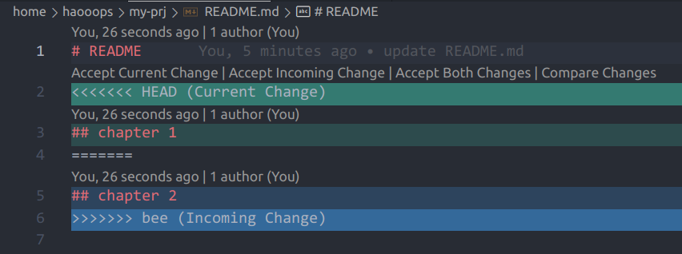

# lec 02 - git 协作，SOC 与裸机程序

## git 协作

在过去的课程中，大家使用 git 往往是进行个人项目的版本管理，很少涉及多人协作的场景。而对于“龙芯杯”比赛而言，则需要小组内成员合理分工，并使用 git 进行协作开发。使用 git 的诀窍在于脑海里时刻有一张有向图：每一个结点表示一次 commit，每一个边表示两次 commit 之间的变化。

在这张图里，所有结点的公共祖先都是第一次 commit：

```
$ mkdir my-prj && cd my-prj
$ touch README.md
$ git init && git add . && git commit -m "init commit"
Initialized empty Git repository in /home/haooops/my-prj/.git/
[master (root-commit) 2d99435] init commit
 1 file changed, 0 insertions(+), 0 deletions(-)
 create mode 100644 README.md

#    HEAD(master)
#      |
#      +
# init commit
#
# 通过 git commit 我们创建了第一个 commit 结点，一个指针
# HEAD 指向我们目前所处的分支 master。
```

对 `README.md` 进行修改：

```
$ echo "# README" >> README.md
$ git add . && git commit -m "update README.md"
[master 0493f9d] update README.md
 1 file changed, 1 insertion(+)

#                HEAD(master)
#                  |
#      +----->-----+
#         "update README.md"
#
# 上图中用一条有向边由第一次 commit 指向第二次 commit，
# 表示第二次 commit 是在第一次的基础上变化而来的。
```

创建并切换一个新的分支：

```
$ git checkout -b new
Switched to a new branch 'new'

#             master HEAD(new)
#                  |/
#      +----->-----+
#         "update README.md"
#
# 此时创建分支实际上只是创建了一个指针，指向与 master
# 相同的 commit 结点。
```

在新的分支上对 `README.md` 进行修改：

```
$ echo "## chapter 1" >> README.md
$ git add . && git commit -m "update README.md"
[new 91a9767] update README.md
 1 file changed, 1 insertion(+)

#                master       HEAD(new)
#                  |           |
#      +----->-----+----->-----+
#                   update README.md
#
# 当我们在 new 上进行修改时，master 指针没有变化。
```

回到 `master` 后创建并切换一个新的分支：

```
$ git checkout master && git checkout -b bee
Switched to branch 'master'
Switched to a new branch 'bee'

#             master HEAD(bee)  new
#                  |/           /
#      +----->-----+----->-----+
#                   update README.md
#
# 创建新分支 bee 的效果与之前从 master 上创建 new 相同。
```

在新的分支上对 `README.md` 进行修改：

```
$ echo "## chapter 2" >> README.md
$ git add . && git commit -m "update README.md"
[bee b8a67e1] update README.md
 1 file changed, 1 insertion(+)

#               master        new
#                  |           |
#      +----->-----+----->-----+
#                  \----->-----+
#                              |
#                           HEAD(bee)
```

合并 new、bee 两个分支到 new：

```
$ git checkout new && git merge bee
Switched to branch 'new'
Auto-merging README.md
CONFLICT (content): Merge conflict in README.md
Automatic merge failed; fix conflicts and then commit the result.
```

此时发生了冲突（conflict），git 提示需要进行手动合并，然后再 commit 一次：
```
$ cat README.md
# README
<<<<<<< HEAD
## chapter 1
=======
## chapter 2
>>>>>>> bee

# git 在冲突文件中将产生冲突的部分标记了出来，其中 === 上面的部分表示目前
# 所处分支 new 中的内容，而 === 下面的部分表示待 merge 分支 bee 的内容。
```

我们可以直接对产生冲突的文件进行修改。在 vscode 中，提供了默认的插件，可以方便地进行分支合并：



根据需要点击选项，留下需要的内容，然后再进行一次 commit：

```
$ git add README.md && git commit -m "merge new and bee"
[new 0c8d026] merge new and bee

#                master                 HEAD(new)
#                  |                       |
#      +----->-----+----->-----+----->-----+
#                  \----->-----+----->-----/
#                              |
#                             bee
#
# 
# 将 bee 合并到 new 后，创建了一次新的 commit，并将
# HEAD 指针移动到该 commit。
```

合并 new 分支到 master：

```
$ git checkout master && git merge new
Updating 0493f9d..0c8d026
Fast-forward
 README.md | 2 ++
 1 file changed, 2 insertions(+)

#                             HEAD(master) new
#                                         \|
#      +----->-----+----->-----+----->-----+
#                  \----->-----+----->-----/
#                              |
#                             bee
#
# 由于 new 是从 master 上发展过来的，因此 merge
# 操作仅仅是将 master 指针移动到了 new。
```

合并的规律：

+ 如果两次 commit 代表的结点有连通的路径，则合并时仅改变指针
+ 如果没有，则会创建一个新的结点，并可能产生冲突

## 总线接口

> “在大多数真实的计算机系统中，CPU 通过总线与系统中的内存、外设进行交互。没有总线，CPU 就是个‘光杆司令’，什么工作也做不了。总线接口可以自行定义，也可以遵照工业的标准。显然，遵照工业界的标准有助于与大量第三方的 IP 进行集成。” — _《CPU 设计实战》_

在大家之前的实验中，我们使用的是同步 RAM 接口，它具有一个很简单的时序：当拍发送地址，下一拍就能返回数据。然而，并不是所有设备都能保证同步 RAM 接口的时序要求：也许从发起请求到收到数据之间会间隔许多时钟周期，这样，数据的请求方就不能默认请求发出的下一拍时，返回的数据是有效的。另一方面，CPU 和其他设备很可能工作在不同的时钟频率下，因此它们的信号是异步的，需要使用接口进行同步。

因此，必须引入**握手**（handshaking）机制，使得数据的**主方**（请求方，master）和数据的**从方**（接收方，slave）能够按照正确的时序协作。同时，接口有利于工业界制定统一的标准，使得设备的扩展变得容易。

在实验中，我们所使用的类 SRAM 接口是自定义接口，之后的 AXI 接口则是工业标准。

## SOC 结构

SOC 描述了**主从设备**、**转换桥**及其**互联关系**，我们可以在 `mycpu_env/soc_verify/soc_hs_bram/soc_lite_top.v` 中找到它的原理图：

```
     -------------------------
     |           cpu         |
     -------------------------
   inst|                  | data
       |                  | 
       |        ---------------------
       |        |    1 x 2 bridge   |
       |        ---------------------
       |             |            |           
       |             |            |           
-------------   -----------   -----------
| inst ram  |   | data ram|   | confreg |
-------------   -----------   -----------
```

在实验用的 SOC 中，CPU 是主设备，inst ram、data ram 和 confreg 是从设备，1 x 2 bridge 是转换桥。

CPU 对外暴露两个类 SRAM 接口，其中一个直接连接到同样具有类 SRAM 接口的 inst ram 上；另一个连接到一个 1 x 2 bridge 上，它的作用是将一个接口变成两个，从而可以连接两个设备：data ram 和 confreg。

## 控制外设

先来看硬件部分。LoongArch 访问外设的方法是 **MMIO**，也就是将外设寄存器直接映射到地址空间上，CPU 通过 `ld/st` 指令进行操作。CPU 访问外设的数据通路是：

+ 流水线向数据类 SRAM 总线发起访存请求（CPU 内部逻辑）
+ 访存请求到达 1 x 2 bridge 上，转换桥进行仲裁，将请求送到与 confreg 相连的总线上（`bridge_1x2.v`）
+ confreg 请求，内部进行处理，改变输出端口的电平（`confreg.v`）
+ 通过约束文件将输出端口绑定到芯片引脚上，从而控制具体的外设（`soc_lite_top.xdc`）

再来看软件部分。我们需要使用 `ld/st` 指令来操作外设，因此，需要知道**访问的地址**以及**读写数据的含义**。在运行的功能测试程序中，我们已经使用了 LED、数码管以及拨码开关这 3 种外设。通过阅读功能测试的代码，可以了解控制它们的方式，而这些控制程序就是它们的**驱动程序**。


#### 注意

外设分为**可探测**和**不可探测**两种，我们所使用的外设**全部为不可探测**外设。因此，需要进行*软硬件协同*，驱动程序开发者需要知道 SOC 设计时为外设分配的地址空间。



### 直接读写外设

以下外设直接通过读写对应的地址映射的寄存器来控制：

|外设名称|地址|宽度|读写属性|读值|写值|
|:---:|:---:|:---:|:---:|:---:|:---:|
|双色 LED|`0xbfaf_f030`<br>`0xbfaf_f040`|32 bit|W|-|`0x0` 熄灭<br>`0x1` 绿色<br>`0x2` 红色|
|单色 LED|`0xbfaf_f020`|32 bit|W|-|末 16 位每比特对应一个 LED，`0x1` 为灭，`0x0` 为亮|
|数码管|`0xbfaf_f050`|32 bit|W|-|32 位每 4 位对应 1 个数码管显示的值|
|拨码开关|`0xbfaf_f060`|32 bit|R|末 8 位每比特对应一个开关，拨上为 `0x0`，拨下为 `0x1`|-|
|矩阵键盘|`0xbfaf_f070`|32 bit|R|末 16 位每比特对应一个按键，松开为 `0x0`，按下为 `0x1`|-|

说明：

+ 双色 LED 有两个地址，分别对应右侧和左侧
+ 矩阵键盘末 16 位与键盘位置对应关系为：

<table>
<tr>
    <td>0</td>
    <td>1</td>
    <td>2</td>
    <td>3</td>
</tr>
<tr>
    <td>4</td>
    <td>5</td>
    <td>6</td>
    <td>7</td>
</tr>
<tr>
    <td>8</td>
    <td>9</td>
    <td>10</td>
    <td>11</td>
</tr>
<tr>
    <td>12</td>
    <td>13</td>
    <td>14</td>
    <td>15</td>
</tr>
</table>


#### 信息

在 confreg 的实现中，拨码开关的复位值被显示到单色 LED 上，有兴趣的同学可以参看 `confreg.v` 了解它是怎么实现的。



### 矩阵键盘

矩阵键盘的实现稍有复杂

### 外部计时器

### 扩展其他外设

在目前的 SOC 中，使用的是类 SRAM 总线接口。前面提到，它是一种自定义接口，因此扩展起来有一些麻烦：我们需要自己编写满足类 SRAM 接口的外设控制器以及转换桥。而后续使用的 AXI 接口则是一种工业接口，在 Vivado 中可以很方便地调用许多具有 AXI 接口的外设控制器以及转换桥（一般采用交叉总线 cross bar 的形式，简称 xbar），并且 Vivado 提供了 Block Design 功能方便我们进行 SOC 设计。

简单来说，扩展外设需要以下几个步骤：

1. 编写 RTL 或调用 IP 核得到外设控制器
2. 为外设控制器分配地址空间，将其通过转换桥接入 SOC
3. 编写对应的驱动程序
